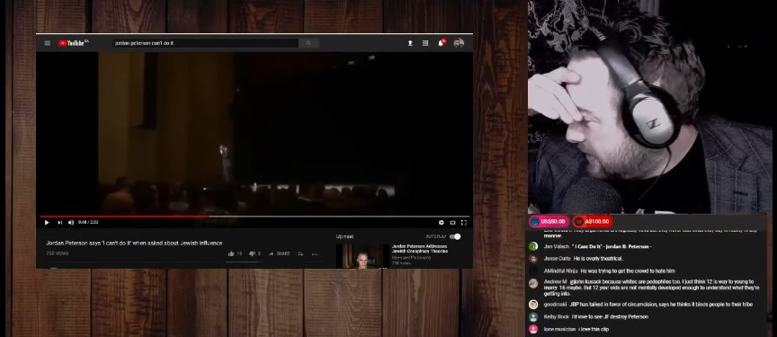
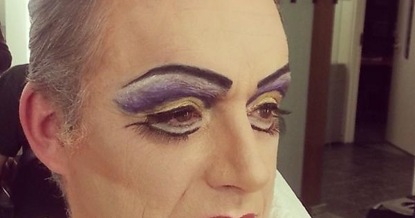

<link rel="stylesheet" href="../github-markdown.css">
<article class="markdown-body">

<red>The owner of the repository does not endorse the message below.
Article is duplicated here for archival purposed and to minimize traffic to the alt-right websites.
In the article, links leading to alt-right web-sites are intentionally broken.</red>

%redacted%/based-frenchman-deconstructs-jordan-petersons-cucking/

# Based Frenchman Deconstructs Jordan Peterson’s Cucking

By *Roy Batty* 2018-02-09

All of these e-celebs have left me with a bad taste in my mouth. Most of them are total cucks and/or freaks.

I mean people think that the Alt-Right is full of freaks, but that’s not true. The Alt-Right is full of outcasts. There’s a difference.

So the dichotomy goes like this:

- the Alt-Right is full of outcasts, not freaks
- the Alt-Lite is full of freaks, not outcasts

Which says a lot about society. The West is totally fine with freaks doing their own thing, in fact, it’s encouraged. But god forbid that young White men should band together to secure their interests. THAT’S the real threat that must be punished.

  
*a drag queen= not a serious threat*

Anyways, to counter the legions of pompous twits with British accents, the Alt-Right had to turn to a man of science with an overpowering French accent.

If British accents = intelligent professor in most normies minds. Then French accents = supreme critic in most normies minds as well. In other words, French accent\>British accent. The French accent can always out-critique the British one.

https://www.youtube.com/watch?v=m6diOTW3deU

JF has some really good analysis of Jordan Peterson’s body language and the implications of his refusal to talk about Solzhenitsyn’s critique of the Jews in this video.

I had never considered this before, but seeing Jordan Peterson as an actor and a performance artist really changes the way I view the guy. Not only that, but JF’s argument that the only thing preventing Jordan Peterson from acknowledging White group rights and the JQ are his own mental boundaries.

Listening to members of the Jordan B. Peterson cult, you might think that the guy was a sort of Christ figure. Like he was taking the sins of the world on his shoulders or something.

Now, after JF’s analysis, I just see it all as an acting prop. A cheap shtick to make normies think he’s deeper and more father-like than he really is.

The illusion in my mind is shattered, and I can see him clearly for the over-hyped Boomer that he is.

Great stuff, JF.
