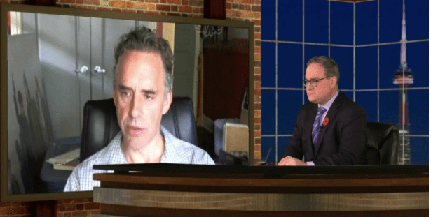

<link rel="stylesheet" href="../github-markdown.css">
<article class="markdown-body">

<red>The owner of the repository does not endorse the message below.
Article is duplicated here for archival purposed and to minimize traffic to the alt-right websites.
In the article, links leading to alt-right web-sites are intentionally broken.</red>

alt-right.com/2018/05/15/ezra-levant-confirms-petersons-closest-allies-jews/

# Ezra Levant Confirms: Peterson’s “Closest Allies” Are Jews

By *Brandon Martinez* 2018-05-15

In one tweet, Canadian Jewish supremacist Ezra Levant, an early supporter of Jordan Peterson, named the Jewish conspirators behind Peterson.

> Jordan Peterson’s closest allies happen to be Jews — just not the self-hating, post-Jews like at The Forward. Dave Rubin, Ben Shapiro, Gad Saad, Brett & Eric Weinstein, Christina Hoff Sommers, ad infinitum. This is laughable — as so much of the Forward is these days.
>
> — Ezra Levant (@ezralevant) [May 12, 2018](https://twitter.com/ezralevant/status/995357224649347072)

That’s a handy list of alt-light Jews backing Peterson, helping give him publicity as the “acceptable face” of rebellion against the cultural marxist (Jewish-led and fostered) left. Among this coterie of Jewish enablers of Peterson is Levant himself, the head of Rebel Media which was one of the outlets that most publicized Peterson in the early days of his rise of fame. Levant also helped Peterson [with fund-raising](#https://thevarsity.ca/2017/05/01/jordan-petersons-federal-funding-denied-rebel-media-picks-up-the-tab/).

In another tweet, Levant defended Peterson from a silly article written in the Jewish Daily Forward which labelled Peterson an “enabler of Jew hatred.” Rebuffing his co-religionists, Levant said Peterson is a “philosemite” who lectures on the Jewish Torah.

> Jordan Peterson is not enabling Jew hatred. He’s a philosemite who gives lectures on the Torah. But you, on the other hand, enable Jew hatred, accelerate it, justify it, by committing shockingly unfair smears of a good man, in the name of Jews. Your article creates anti-Semitism. [https://t.co/oosybu5Cs1](https://t.co/oosybu5Cs1)
>
> — Ezra Levant (@ezralevant) [May 12, 2018](https://twitter.com/ezralevant/status/995355690104508419)

In response to shrill Zionist Deborah Lipstadt, who piled on in denouncing Peterson as an enabler of anti-Semitism, Peterson affirmed his pro-Jewish credentials, writing that he’s “been teaching students … about the horrors of the holocaust with extreme diligence for thirty years” and [has “lectured about the dangers of fascism and its attendant antisemitism for almost four decades.”](https://jordanbpeterson.com/philosophy/the-forward-fiasco/)

> An open message to Dr. Deborah Lipstadt [@deborahlipstadt](https://twitter.com/deborahlipstadt) who so carelessly joined Ari Feldman [@aefeldman](https://twitter.com/aefeldman) in his deceitful denouncement: [https://t.co/z7O9v1ci3D](https://t.co/z7O9v1ci3D) [pic.twitter.com/qkstPqmhd5](https://t.co/qkstPqmhd5)
>
> — Jordan B Peterson (@jordanbpeterson) [May 12, 2018](https://twitter.com/jordanbpeterson/status/995224048765464576)

He informed Libstadt that she has “confused a friend with an enemy.” So there it is. Peterson wants us to know that he’s been brainwashing students with Holohoax and anti-fascist propaganda for decades, and is an ally of our Zionist enemy.

This recent denunciation of Peterson is a double-fake by various factions of Jews. Far-left Jews will label Peterson far-right, alt-right, a “Nazi enabler,” etc., which gives him some street cred among genuine alt-righters. This distracts attention from the fact that Peterson is philosemitic controlled opposition surrounded by Jews, hence why he fiercely defends the Jews and their hold on power.

There are two possibilities here: the Jews surrounding Peterson are there to make sure his discourse doesn’t stray outside of Jewry’s approved parameters; or he was bought from the beginning and these are his Jewish managers.

In any case this is an example of Jews controlling all sides of the debate with their hand-selected spokesmen who, following their Jewish script, dutifully avoid any discussion of Jewish influence and its negative impact.
