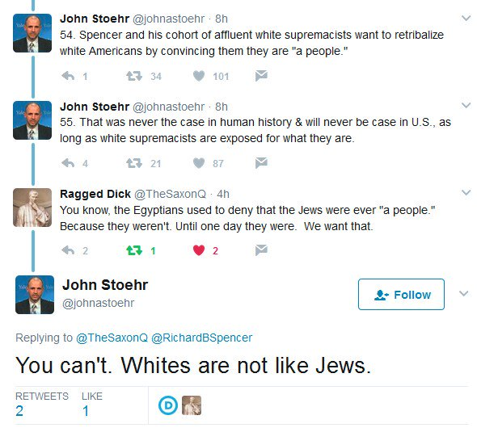

<link rel="stylesheet" href="../github-markdown.css">
<article class="markdown-body">

<red>The owner of the repository does not endorse the message below.
Article is duplicated here for archival purposed and to minimize traffic to the alt-right websites.
In the article, links leading to alt-right web-sites are intentionally broken.</red>

https://altright.com/2017/11/29/jordan-peterson-goes-full-shill-and-counter-signals-white-identity/

# Jordan Peterson Goes Full Shill And Counter-Signals White Identity

By *Vincent Law* 2017-11-29T15:30:36

## The radical centrists strike again!

I’ve written about Jordan Peterson before and [my description of him wasn’t exactly flattering.](#https://altright.com/2017/11/24/wilfrid-laurier-university-commissars-interrogate-girl-for-showing-jordan-peterson-video/) Last night he had a meltdown while debating Frog Twitter. He came out swinging against “collectivism” and in particular White Identity.

> Now the right-wing identitarians have their panties in a knot about what I've said about the pathology of racial pride…. Demonstrating (as if it is necessary) that the mirror reflection of malevolence is also…. malevolence. [twitter.com/hetiestsin/status/935739281091584000](https://twitter.com/hetiestsin/status/935739281091584000)
>
> — Jordan B Peterson (@jordanbpeterson) [November 29, 2017](https://twitter.com/jordanbpeterson/status/935740525063430144)

And I know what you’re thinking, he obviously went after the Jews and POCs for their “collectivism” tendencies too, right?

Wrong.

But why talk about some minor Canadian e-celeb whose only claim to fame is his refusal to call mentally ill trannys by their preferred gender pronoun?

Well, he’s part of this interesting third faction that has emerged out of the recent culture wars on social media, youtube and even the streets of North America.

What’s fascinating is that Peterson and his ilk think of themselves as the successors of the American victory in World War II and the defeat of Communism at the end of the Cold War. To them, the last century has been an epic battle between the forces of “collectivism” in various manifestations (Fascism and Communism) and the forces of enlightened individualism (Liberal Democracy).

So he sees himself as an enlightened individualist. To paraphrase- someone who doesn’t judge based on race, religion or any other form of group identity.

In his conception of the world, people are atoms, rootless little marbles bouncing along and randomly hitting up against one another from time to time. To take pride in one’s heritage is immoral – at least according to him and the other great individualist thinkers of our time Paul Joseph Watson, Sargon of Mossad or say, Ben Shapiro. These people are not an ignorable minority, in fact they characterize the only other acceptable camp of thought present now in the West.

They think that they can fight SJWism in the same way the Americans fought the Communists and then pivot right to take out the Alt-Right Fascists like they did in WWII (again, this is how THEY think).

But this line of thinking is not without its logical pitfalls that are glaringly apparent to us in the Alt-Right.

Seriously, he’s not the only one that sees the world in these terms. An entire generation of Americans and Canadians see World War II and the Cold War as proof that their side is the only morally righteous side. In their mind, the war wasn’t about America’s pivot into becoming the worldwide hegemon but about America becoming the avatar of liberal democratic values and winning because of it.

I reserve a special sort of disgust for people that think this way.

When one looks at the final result of half a century of Liberal Democracy in the West, it seems that Communism was by far less damaging to the spirit and health of the people than what sex, drugs and rock & roll wrought.

[The European Grammar of Self-Intolerance \[Jonathan Bowden\]](https://www.youtube.com/watch?v=aR4MvD9IEAE)

How can this be?

It’s almost as if radical individualism directly led to the snowflake phenomenon of today where everyone is forced to express their identity through their consumer choices, sexual identity and virtue-signaling because they’re not allowed to have any other form of identity. They’d be labeled Fascists if they did. For a man interested in fighting “post-modernism” he seems to be completely unaware of what post-modernism is and how it came about.

But Peterson is a fan of Jung, so what would he say about Jung’s disturbing acknowledgement of the importance of inherited identity?

[Being in the West: Personalism, Positivism and Ethnicity](https://www.youtube.com/watch?v=beRNIxYsxcw)

(skip to 27:17, but watch the entire video as well when you get the chance)

What else is there to say about these people except that they’re dangerous to say the least, and not as much of a gateway to us as some Alt-Righters like to think. If anything, they are gate-keepers and speed bumps that allow people to take the easy way out of confronting the social malaise of our times.

They’re halfway rest-stops that allow people turned off by the rabid SJW left to counter-signal their opposition in a comfortable way and without embracing White Identity. They think that if collectivism in general can be stopped, things can go back to normal, back to the times when everything was implicitly White.

But we know that this will not work. These predominantly White or Jewish voices have literally no pull over the ethnic communities of non-Whites. Their words fall on deaf ears. Everyone is closing ranks in 2017, and yet they have the gall to condemn Whites for just barely starting to do the same.

[Cowardice And Individualism by Dr. William Luther Pierce](https://www.youtube.com/watch?v=LsB5vHs_83Q)

And the truth of the matter is that this faction’s message only appeals to cowards, shekel-grabbers and opportunists.

Hell, from a strategic point of view, we should thank our lucky stars for the fact that insane and polarizing SJWs exist and spend our time tearing into these Radical Centrists, Skeptics, Enlightened Individualists (or whatever they like to call themselves) instead of the people who create new Alt-Right recruits every single day. Balkanization helps our cause and undermines the soft, squishy, “let’s all just get along” center.

That’s just the truth of it. That’s some RealPolitik for you.

And the best part is that we are only a few more riots, terror attacks and Antifa actions away from this Tower of Babel finally toppling down.
