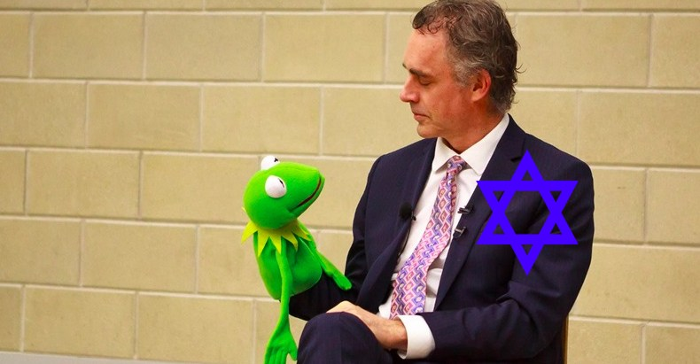
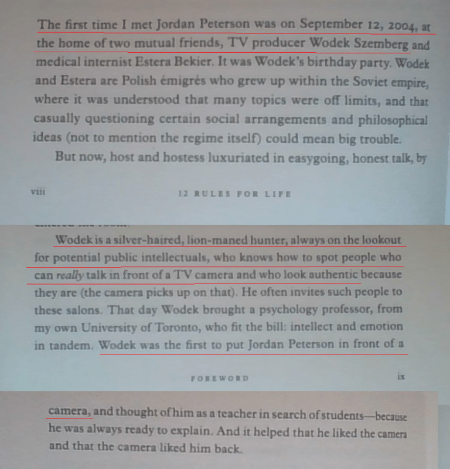

<link rel="stylesheet" href="../github-markdown.css">
<article class="markdown-body">

<red>The owner of the repository does not endorse the message below.
Article is duplicated here for archival purposed and to minimize traffic to the alt-right websites.
In the article, links leading to alt-right web-sites are intentionally broken.</red>

alt-right.com/2018/05/12/jordan-peterson-hand-selected-jewish-tv-producer-lead-dissent/

# Was Jordan Peterson Hand-Selected by Jewish TV Producer to Lead Dissent?

By *Brandon Martinez* 2018-05-12

Our good friend Jordan Peterson, also known as Hermit the Frog, has come under increasing scrutiny from the alt-right for [his maniacal cucking on the Jewish question](https://jordanbpeterson.com/psychology/on-the-so-called-jewish-question/). Peterson has numerously defended Jewish overrepresentation in power, hypothesizing that the phenomenon comes down to their higher average IQs as opposed to insider nepotism which carries more weight in the alt-right intellectual sphere.

[A Reddit user](https://www.reddit.com/r/conspiracy/comments/8irejl/is_jordan_peterson_controlled_opposition/) has dug up an excerpt from the foreword of Peterson’s book _12 Rules for Life_ which relates how a Canadian-Jewish TV producer named Wodek Szemberg hand-selected Peterson to be a “public intellectual.” Wodek, a producer for the popular Canadian public affairs show The Agenda, is said to be “the first to put Peterson in front of a camera” after recognizing his gift of the gab.

While this is not rock-solid proof of an organized Jewish conspiracy to elevate Peterson into his current guru role, it shows that Peterson was groomed by a Jewish television producer to lead public dissent against the radical left… lead it astray into the Jew-friendly dead end of classical liberalism. In one of his apologist videos about the Jewish question, Peterson himself attested to having a large social circle of Jewish friends and colleagues. He works at the University of Toronto, which is dominated by Jews. So at the very least Peterson has been surrounded by Jewish influences and certain Jews have played a role in making him famous knowing his personal attitudes towards and sympathies for the Jews.

Peterson’s [one-size-fits-all cop out for Jewish power](https://www.youtube.com/watch?v=JQHH6o9ual8) is to say they’re just more intelligent than us inferior Gentiles. This line has now become ubiquitous among the alt-light crowd. The professor’s promoters at the CBC seem to agree with [his thesis about Jewish genius](http://www.cbc.ca/documentarychannel/docs/whats-with-the-jews1). But Jewish genius is radically overhyped by tribalistic Jews who rig the game to elevate their own to the top. In the case of Albert Einstein, his “genius” was largely fraudulent. His “groundbreaking” scientific discoveries [were plagiarized from more intelligent White Gentile scientists](#http://www.cartesio-episteme.net/episteme/epi6/ep6-bjerk-rec.htm). That didn’t stop Einstein’s tribal co-religionists in academia and the media from constructing a phony myth about his genius, covering up his academic misdeeds and discrediting his Gentile superiors in the field.

Even if true, Jewish intelligence alone can’t explain their enormous influence over political and cultural institutions considering their tiny numbers among similarly high-IQ whites. Rather, the theory of [nepotistic conspiracy has more solid grounding](https://www.amazon.com/Culture-Critique-Evolutionary-Twentieth-Century-Intellectual/dp/0759672229). Jewish business practices are akin to that of a mafia. They push out their Gentile competition using the most underhanded, backstabbing methods, including murder and blackmail. They usually take over the businesses of more accomplished Gentiles after all the hard work and innovation has already been done, like we saw with [the Jewish takeover of the American film industry](#http://www.fourwinds10.com/siterun_data/history/zionism/news.php?q=1278910113). All the pioneers of motion picture technology were White Anglo-Saxon Protestants, principally Thomas Edison – Jews simply came in later hijacking the technology for their own profit.

There’s no doubt that Western Ashkenazi Jews possess high intelligence on average. But a bigger factor in their success is their ruthless tribalistic culture and anti-Gentile atavism, which drives their quest to dominate the societies that they choose to live in. There’s also the issue of [Jewish religious texts predicting and even mapping out their control of the world](#https://www.enkiptahsatya.com/43-the-hebrew-bible-a-sinister-blueprint-for-the-zionist-new-world-order.html), which partly explains their penchant and motivation for power grabbing. If it’s just intelligence, then it’s a mystery why Chinese and East Asians aren’t equally as influential in the West. East Asians are equally as intelligent on the IQ scale as Jews, yet those groups do not form such dominant cultural, financial and political power blocs in countries outside of Asia where they are minorities. So with Jews, it really comes down to their cultural, religious and even biological predilections towards power and wealth acquisition, strongly rooted in the [ancient teachings of the vicious, supremacist faith of Judaism](#https://www.enkiptahsatya.com/43-the-hebrew-bible-a-sinister-blueprint-for-the-zionist-new-world-order.html).

Peterson sidesteps completely the question of whether Jewish overrepresentation in power is objectively good or bad – he simply states that they obtained that power without a sinister conspiracy. Whether it was a conspiracy or not, they have this power and use it against the Gentile majority races with whom they live. Their power is, for the most part, detrimental to the white majority in all Western countries.

Peterson has attacked the radical left on classical liberal grounds but has sailed far clear of the Jewish influence over cultural marxism and its offshoots. He has studiously avoided the Jewish ethnic motivation to foster multiculturalism, mass immigration, feminism, censorship, minority empowerment, and even pornography in the West as an attack against the white Christian majority. All of that is designed to weaken and degrade the host culture/race, rendering it unable to assert itself collectively against Jewish dominance.

A weak, atomized, highly-individualistic society is what Jews prefer because in such a scenario Jewish tribalism reigns supreme. This is all completely taboo in the fake opposition classical liberal camp who oppose certain aspects of the far left but don’t go far enough and dutifully guard the gates of Jewish privilege underpinning it all.

While Peterson opposes identity politics in all forms – including, and especially, white nationalism – he is suspiciously mute on the Jewish identity politics of Israel. That country is a Jewish ethnostate with dozens of enshrined laws to protect the Jewish majority there. Peterson forcefully counter-signals Black Lives Matter and white nationalists, but is surprisingly soft on Zionism, Israel and the potent identity politics of the Jews. Nor does he mention the inclination of Western Jews to hold loyalty to Israel rather than the countries they live in, which is evident by the fact that diaspora Jewry acts as a giant lobbying bloc for Israeli geopolitical interests in Western states, and have spearheaded the push for wars against Arab/Muslim states in conflict with Israel.

Why is this? At the very least Peterson owes his current fame to Jews like Szemberg who helped promote him in the early days of the gender debate in Canada. He also relies heavily on maintsream media appearances to promote his brand of classical liberal controlled opposition, and he most certainly knows Jews dominate those networks and can easily shut him out of the public debate. Thirdly, he is dependant on a large donor base to keep him going. He apparently makes upwards of $50,000 a month on Patreon donations from his cult followers. To keep these shekels flowing in, he must dodge the most controversial truths of our time, those of the Jewish problem and racial realism.

So we can conclude a few things: that a Jewish television producer put Peterson on the map, that Jewish-dominated mainstream media outlets give him incredible coverage and access, and that his fierce pro-Jewish stance indicates a loyalty to the Jews supporting and promoting  him. This makes Peterson essentially a tool of the powerful Jews backing his weak, inconsequential pushback against radical leftism.

We know that during times of counter-cultural revolution against a ruling structure that is dominated by Jews, these same Jews will sponsor the opposition to their own power in order to control it, misdirect it and most importantly keep it away from naming them as the elite string-pullers who have foisted numerous social ills plaguing our societies. They pulled this same stunt during the Cold War, when Senator Joe McCarthy in the US was hunting down communists in the government, media and Hollywood. Since the communist phenomenon was largely Jewish, Jews planted several operatives within McCarthy’s anti-communist camp in order to control the damage against their own as well as to isolate the debate to a mere discussion of communist ideology instead of the vastly disproportionate number of Jews involved in it and the Jewish Talmudic roots of communism itself.

They’re doing the same thing now with the alt-light movement, which is led by Jewish homosexuals like Milo Yiannopoulos and bought-off [Zionist Gentiles like Gavin McInnes and Faith Goldy](#http://alt-right.com/2017/12/02/faith-goldy-gavin-mcinnes-zionist-supercucks/). These elements are by-products of Jewish game theorists who predict cultural and political trends, and get one step ahead of their opposition in order to squash a genuine people’s revolt against the malevolent Jewish elite running our countries into the ground.
